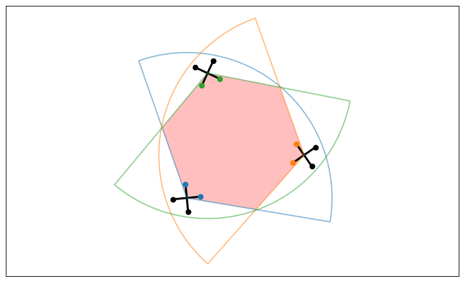
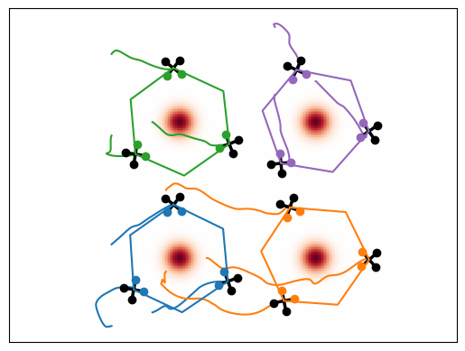
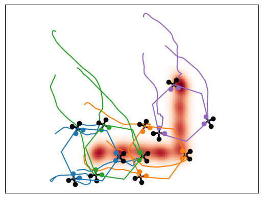

# formation_control

Formation Control for cooperative area coverage by a Multi-Robot System.

## Dependencies

- ROS Noetic
- [osqp-eigen](https://github.com/robotology/osqp-eigen)
- [gmm_msgs](https://github.com/MatCat960/gmm_msgs) - branch `ros1-noetic`
- [gmm_coverage](https://github.com/MatCat960/gmm_coverage) - branch `ros1-noetic`

## How it works

Robots within the MRS are split into clusters for cooperative area coverage. The collectively monitored area results from the intersection of FoVs of robots in a cluster:



1. Launch the simulation environment:
```bash
roslaunch formation_control drones_sim.launch
```

2. Launch the low-level control node for single drones:
```bash
roslaunch formation_control formation_control.launch
```
3. Define the probability density of the environment with one of the following:

- Drawing the region as a polygon on a GUI:
```bash
rosrun gmm_coverage interface.py
```

- Defining different spots of interest:
```bash
rosrun gmm_coverage clusters_gmm.py
```

4. Launch the high-level control node to move the virtual agent:
```bash
roslaunch formation_control virtual_agent.launch
```


## Results

Robots reach a configuration that maximizes the cooperative coverage of areas of interest:

  